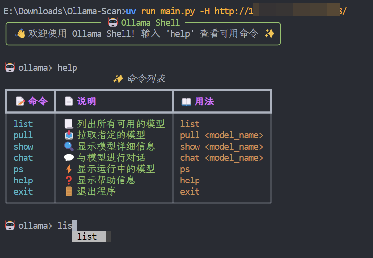
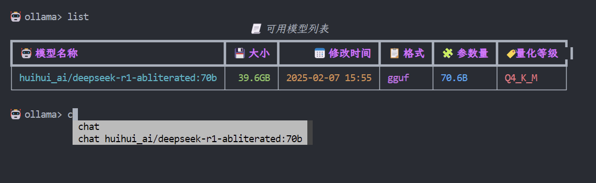
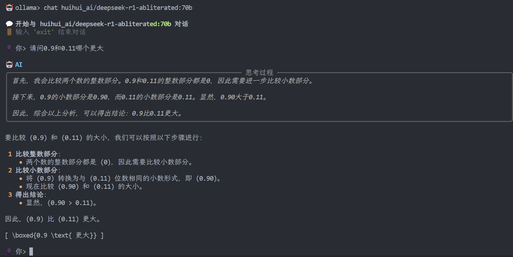

# Ollama-Scan

> 由于 Ollama 内部没有鉴权方式，我重构了一下代码，变成了命令行交互式的工具，提供自动补全。这是练手的工具，大家如果觉得好用可以多多 star，~~如果能冲到 100 个 star 那就更好了（~~，已经 100 star 了，感谢佬友们支持，如果有觉得不好用的地方还请多多提 issue
>
> Ollama 服务器发现我一般会使用 https://hunter.qianxin.com 配合语法 `app.name=“Ollama Server”&&is_domain=“False”`

一个基于 Ollama 的命令行工具，提供友好的交互式界面来管理和使用 Ollama 模型。







## ✨ 功能特性

- 📃 列出所有可用的模型
- 📥 拉取新的模型
- 🔍 查看模型详细信息
- 💬 与模型进行对话
- ⚡️ 查看运行中的模型进程
- 🎨 美观的命令行界面（使用 Rich 库）
- 🔄 交互式命令补全

## 🚀 安装

1. 克隆仓库：
```bash
git clone https://github.com/b3nguang/Ollama-Scan.git
cd Ollama-Scan
```

2. 安装依赖：
```bash
pip install -r requirements.txt
```

## 📖 使用方法

运行程序：
```bash
python main.py [--host HOST]
```

### 可用命令：

- `list` - 📃 列出所有可用模型
- `pull <model_name>` - 📥 拉取指定模型
- `show <model_name>` - 🔍 显示模型详细信息
- `chat <model_name>` - 💬 与指定模型对话
- `ps` - ⚡️ 显示运行中的模型进程
- `help` - ❓ 显示帮助信息
- `exit` - 🚪 退出程序

## 🛠️ 环境要求

- Python 3.6+
- Ollama 服务器

## 📝 作者

- b3nguang

## 📄 许可证

本项目采用 MIT 许可证
